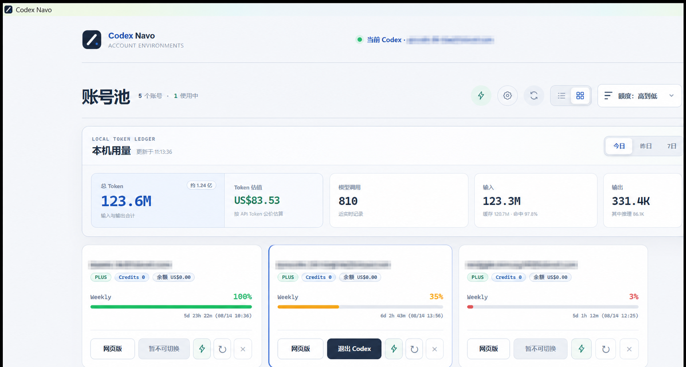
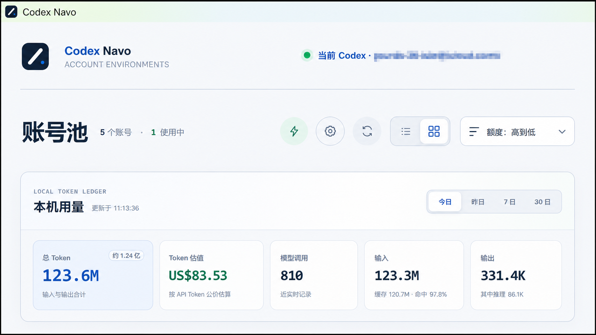
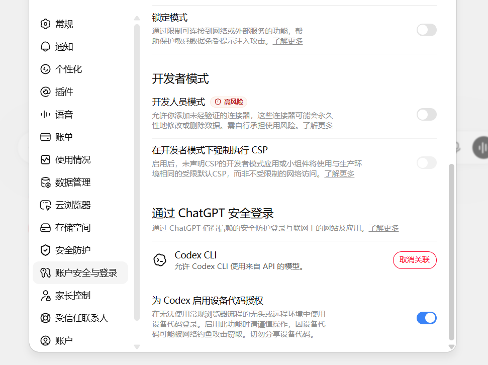

# Codex Navo

面向 Windows 的本地 Codex 账号环境切换器。每个账号使用独立的 Chrome 浏览器配置与 Codex 认证目录；切换账号时继续使用同一套本地项目和任务数据。

> [!IMPORTANT]
> Codex Navo 不是 OpenAI 官方产品，与 OpenAI 无隶属或背书关系。请只管理你有权使用的账号，并遵守适用的服务条款、订阅规则和组织政策。

## 界面预览





## 下载与安装

普通用户建议从仓库右侧的 **Releases** 下载最新安装版：

[下载最新版本](https://github.com/1080ssf/codex-navo/releases/latest)

1. 下载 `Codex-Navo-Setup-<版本>-windows-x64.exe`。
2. 按安装向导完成安装。
3. 后续版本会由应用自动检查；下载完成后由用户确认重启安装。
4. 如果 Windows SmartScreen 提示“未知发布者”，请确认安装包来自本仓库的官方 Release 页面；公开分发版本目前没有商业代码签名。

安装版已经包含 Electron 和本地服务运行时，不需要安装 Node.js。需要预先安装：

- Windows 11 x64
- Google Chrome
- Codex 桌面应用
- Codex CLI（用于首次设备授权）

## 第一次使用

1. 点击“添加账号”，填写本机可识别的账号名称。
2. 在自动打开的独立浏览器中完成 ChatGPT 官方登录。
3. 在 ChatGPT 网页端依次进入 **设置 → 账户安全与登录**，开启 **“为 Codex 启用设备代码授权”**。
4. 回到应用，点击“已登录，继续授权”，确认上述开关已开启，再完成 Codex 官方设备授权。
5. 授权完成后，账号进入账号池。
6. 以后可以直接打开该账号网页端，或切换并启动 Codex 桌面端。

> [!IMPORTANT]
> 必须先开启“为 Codex 启用设备代码授权”，再继续 Codex 授权。未开启时，官方设备授权流程可能无法继续或返回错误。



关闭主窗口不会退出程序，而是隐藏到 Windows 系统托盘。点击托盘图标可重新显示；右键托盘并选择“退出应用”才会彻底关闭本地服务。

## 主要功能

- 为每个账号维护独立浏览器配置目录
- 只使用 OpenAI 官方网页和设备授权流程
- 切换 Codex 桌面端账号，同时保留本机项目与任务
- 显示套餐、Codex 点数和周额度
- 当前账号每分钟、其他账号每五分钟自动刷新额度
- 手动刷新单个账号或全部账号额度
- 手动唤醒单个或全部账号，并可按每日时间或额度重置自动唤醒
- 为唤醒请求选择模型、推理强度和发送内容
- 按当前账号、剩余额度、名称或添加时间排序
- 在列表与卡片视图之间切换，并记住上次选择
- 统计本机 Codex 模型调用、输入、缓存、输出、缓存命中率和 Token 估值
- 按今日、昨日、近 7 天、近 30 天或全部范围查看总量与单账号用量
- 列表视图支持独立折叠每个账号的用量详情，并记住折叠状态
- 再次打开账号网页端时恢复该账号上次关闭的 Chrome 窗口
- 管理服务只监听 `127.0.0.1`
- 关闭窗口后驻留 Windows 系统托盘
- 从 GitHub Releases 检查、下载并安装应用更新

## 账号唤醒

“唤醒账号”会使用该账号已经完成的 Codex 授权发送一次真实请求，适合在额度重置后建立新的使用周期。该操作会消耗少量额度，不是模拟按钮。

- 支持手动唤醒单个账号或全部账号。
- 自动唤醒默认关闭，可选择每天执行一次，或在额度重置后执行一次。
- 额度重置检测同时参考预计重置时间、重置时间变化和剩余额度恢复。
- 可以选择 Codex 模型、推理强度和发送内容。
- 自动任务失败后会保留状态并稍后重试，不会在短时间内持续重复请求。

启用自动唤醒前，请确认该使用方式符合你的账号订阅规则和组织政策。

## 本机 Token 用量

Codex Navo 会读取 Codex 在本机生成的 `token_count` 事件，按账号启动区间汇总模型调用、输入 Token、缓存输入、输出 Token、缓存命中率和 Token 估值。统计数据只保存在本机，不会上传到项目仓库或第三方服务。

- “模型调用”表示模型实际推理调用次数，不等同于用户发送的消息数量。
- “Token 估值”按对应模型的 OpenAI API Token 公开价格计算，不是 Plus/Pro 订阅的实际扣款。
- Token 估值不包含 Web Search、图像生成、Computer Use 等可能单独计费的工具调用。
- 一亿以上的 Token 仍以 `M` 为主值，并额外显示中文“亿”单位提示；悬停可查看完整数字。
- 会话从 `sessions` 移动到 `archived_sessions` 时会沿用原统计游标，避免重复累计。

## 数据与隐私

安装版会把运行数据保存在 `%LOCALAPPDATA%\Codex Switchboard`，升级和卸载程序默认不会删除这些数据。该目录名为早期版本遗留名称，为保证升级后仍能读取原有账号环境而继续保留：

| 路径 | 内容 | 是否敏感 |
| --- | --- | --- |
| `%LOCALAPPDATA%\Codex Switchboard\config\accounts.json` | 账号显示名称、邮箱提示和额度缓存 | 是 |
| `%LOCALAPPDATA%\Codex Switchboard\config\settings.json` | 本机设置和可选的绝对路径 | 可能 |
| `%LOCALAPPDATA%\Codex Switchboard\profiles\browser\` | 独立浏览器配置，可能包含有效 Cookie | 高度敏感 |
| `%LOCALAPPDATA%\Codex Switchboard\profiles\codex\` | 每个账号的 Codex `auth.json` | 高度敏感 |
| `%LOCALAPPDATA%\Codex Switchboard\data\` | 本地访问令牌、租约、日志和状态 | 高度敏感 |

上述路径均已加入 `.gitignore`。不要将它们上传到 Git、网盘、Issue、聊天工具或公开截图中。本工具不会导出 Cookie、密码或令牌，也不会绕过密码、验证码、安全检查或服务端风控。

> [!WARNING]
> Codex 桌面端是单实例应用。切换或退出账号前，请先让正在运行的任务安全结束，否则任务可能被中断。

## 从源码运行

开发环境需要 Node.js 20 或更高版本：

```powershell
git clone https://github.com/1080ssf/codex-navo.git
cd codex-navo
npm install
Copy-Item config/settings.example.json config/settings.json
npm run dev
```

也可以双击 `启动桌面开发版.bat`。

`config/settings.json` 示例：

```json
{
  "port": 47821,
  "operators": [],
  "browserExecutable": "",
  "codexDesktopExecutable": "",
  "codexCliExecutable": "",
  "browserStartUrl": "https://chatgpt.com/",
  "mockLaunch": false
}
```

路径留空时会自动探测。`mockLaunch` 仅用于测试，不会真的打开浏览器或 Codex。

## 测试与构建

```powershell
npm test
npm run test:smoke
npm audit --audit-level=high
npm run build:desktop
```

安装版输出到 `release/auto-update/`。发布自动更新版本时，必须把 Setup 安装程序、`.blockmap` 和 `latest.yml` 一起上传到同一个非草稿 GitHub Release。开发模式不会连接更新服务。

## 已知限制

- 当前只针对 Windows 11 x64 测试。
- 未签名的 EXE 可能触发 SmartScreen。
- 浏览器或 Codex 会话失效后，需要重新完成官方认证。
- 不支持把有效登录状态无验证迁移到另一台电脑。
- 不支持同时运行多个 Codex 桌面端实例。

## 参与和安全报告

- 发现普通问题：提交 GitHub Issue，但不要附带账号、日志、认证文件或未打码截图。
- 发现安全问题：优先使用 GitHub Private Vulnerability Reporting，详见 [SECURITY.md](SECURITY.md)。
- 第一次发布本项目：按照 [GitHub 首次发布指南](docs/PUBLISHING.md) 操作。

## 许可证

[MIT License](LICENSE)
