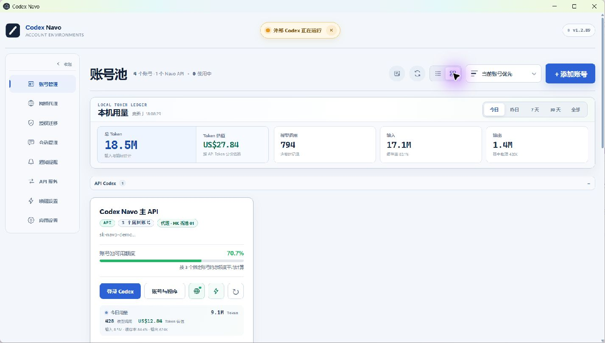
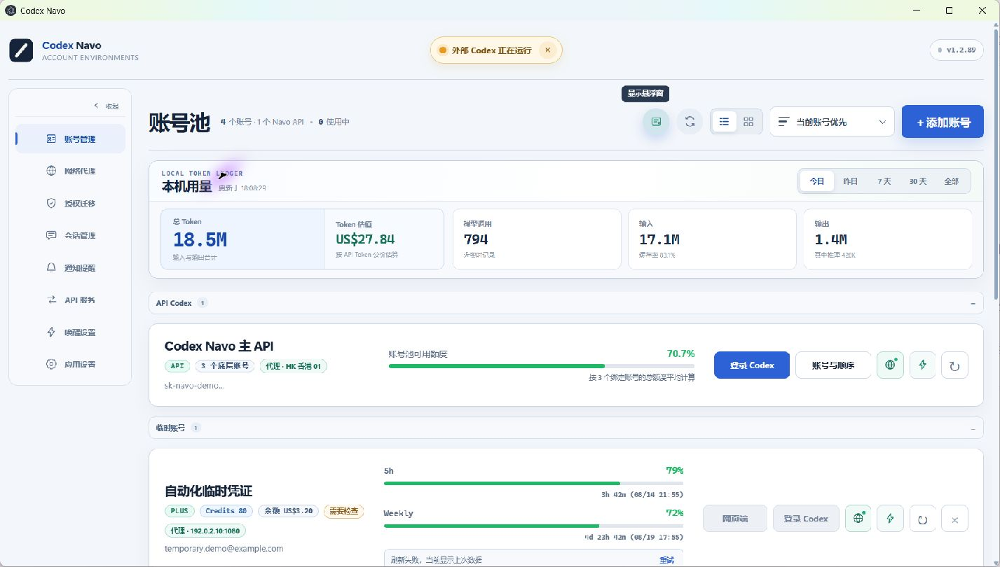
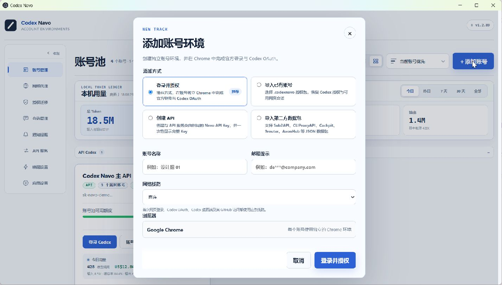
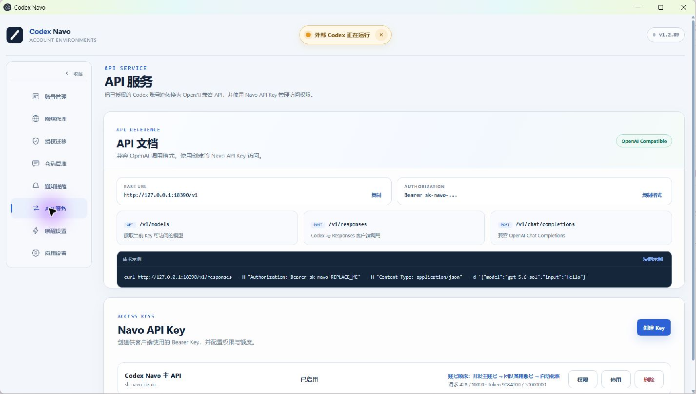
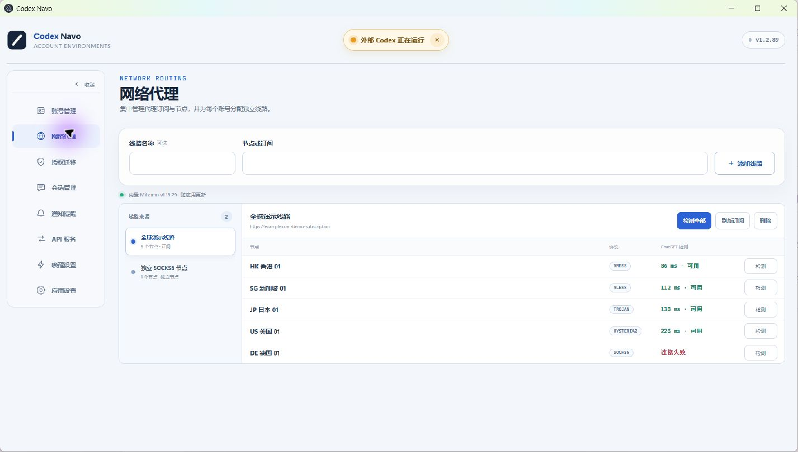
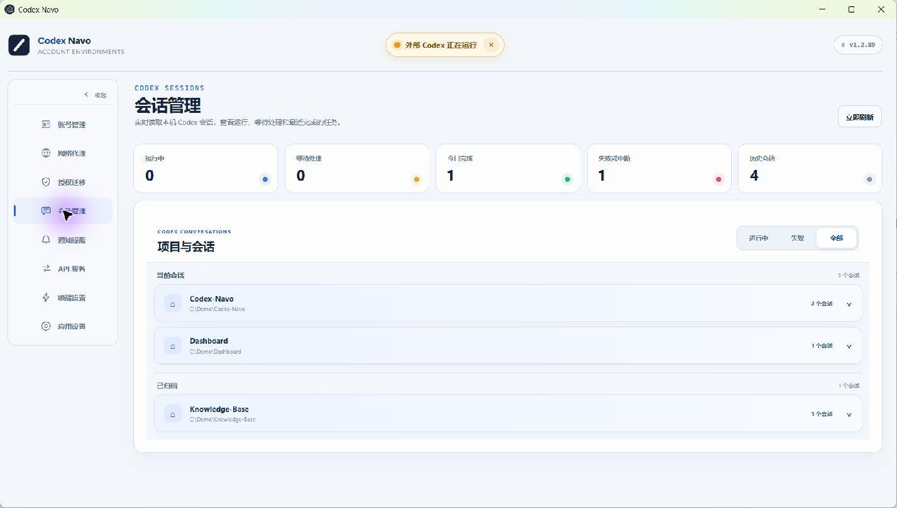
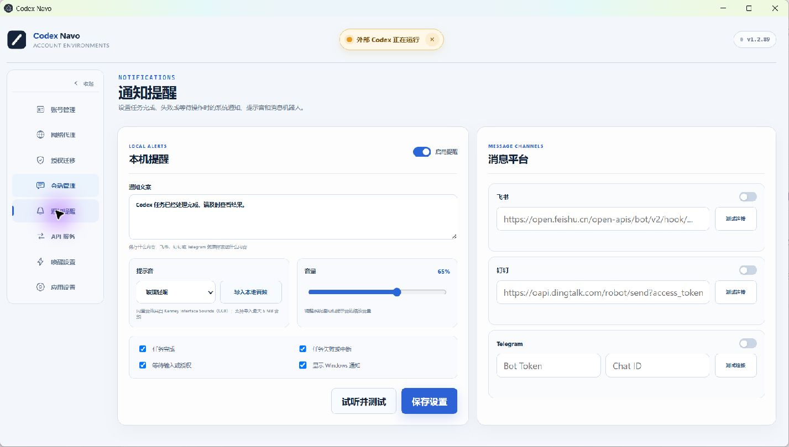
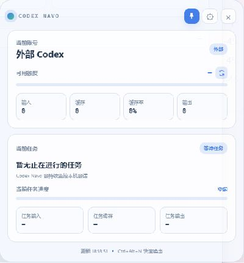
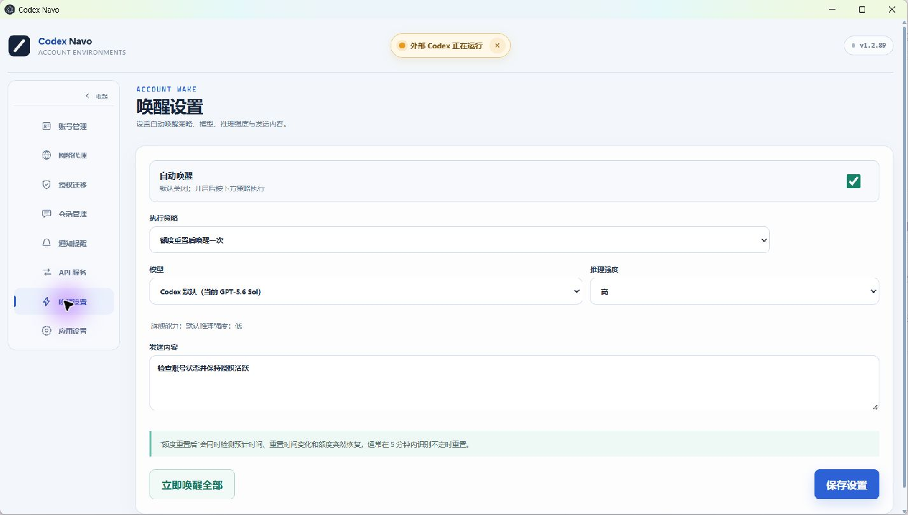
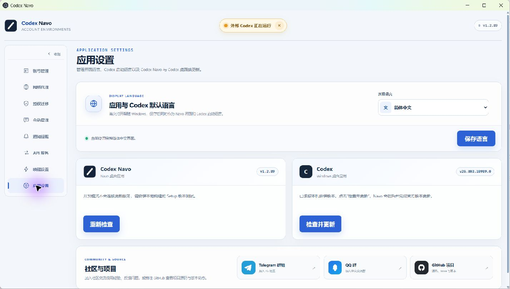

# Codex Navo

> 面向 Windows 的开源 Codex 多账号工作台：在一个桌面应用里完成账号隔离与切换、额度和 Token 统计、API 账号池、网络代理、项目会话管理、通知与悬浮窗。

[](https://github.com/1080ssf/codex-navo/releases/latest)
[](LICENSE)
[](#安装与快速开始)
[](https://t.me/+4VH9hBsRu7phNjg1)
[](https://qm.qq.com/q/f92ySNuLss)



## 为什么使用 Codex Navo

当账号、项目、代理线路和 Codex 会话逐渐增多，手工切换授权很容易打断工作。Codex Navo 把这些流程集中到一个本地优先的桌面应用中：每个普通账号拥有独立环境，项目与会话继续保留；多个账号还可以组成 OpenAI 兼容 API 账号池，在额度耗尽、限流或临时错误时尝试下一个可用账号。

### 核心优势

- **账号真正隔离**：每个普通账号使用独立 Chrome 用户目录、Cookie、网页登录状态和 Codex OAuth，账号之间互不串号。
- **切换不丢工作**：切换的是账号授权，不是工作目录；启动 Codex 时可选择语言、项目和要加载的会话。
- **三类账号统一管理**：普通账号、临时账号和 API Codex 分组展示，支持独立折叠、卡片/列表视图和排序。
- **额度与用量一眼可见**：集中查看 5h、Weekly、Credits、余额、重置时间，以及输入、缓存、输出、缓存率和 Token 估值。
- **内置 API 账号池**：将已授权账号组合为 OpenAI 兼容 API，支持账号顺序、可用模型、按 Key 授权和自动故障切换。
- **代理能力覆盖完整链路**：登录、OAuth、额度刷新、唤醒、Codex 启动和 API 请求都可走指定线路；支持账号级和 API Key 级分配。
- **项目和会话可管理**：按项目归类进行中、失败、全部与已归档会话，并提供折叠、归档、删除和失败记录清理。
- **任务状态随时可见**：通知渠道、提示音和悬浮窗共同展示账号、额度、任务进度与本次 Token 消耗。
- **本地优先**：账号配置、节点、用量和会话索引保存在本机；Navo API Key 只保存加盐哈希，完整 Key 仅创建时显示一次。

## 功能总览

| 模块 | 主要能力 |
| --- | --- |
| 账号管理 | 独立 Chrome、OAuth 授权、普通/临时/API 分类、额度刷新、卡片/列表视图 |
| 启动 Codex | 代理预检、项目与会话按需加载、语言选择、启动进度提示 |
| 用量统计 | 今日/昨日/7 天/30 天/全部，输入、缓存、输出、缓存率、模型调用与估值 |
| API 服务 | `/v1/models`、`/v1/responses`、`/v1/chat/completions`、账号池故障切换 |
| 网络代理 | 订阅与单节点、逐节点检测、随检随显示、延迟排序、账号/Key 独立路由 |
| 会话管理 | 项目分组、进行中/失败/全部/已归档、归档、删除与失败列表清理 |
| 通知提醒 | Windows 通知、飞书、钉钉、Telegram、自定义文案、本地提示音导入 |
| 悬浮窗 | 当前账号、额度、全局与任务 Token、任务进度、样式、透明度、置顶和快捷召回 |
| 应用设置 | Navo 与 Codex 默认语言、Navo 更新、Codex 应用内更新、社区入口 |

## 账号池与用量

卡片模式适合查看单个账号的完整信息；列表模式在账号较多时更紧凑。API Codex 的进度条按绑定账号的可用额度汇总计算，普通账号和临时账号则分别展示自己的额度与状态。




本机用量支持今日、昨日、近 7 天、近 30 天和全部时间范围。缓存率按缓存输入占总输入计算；Token 估值仅按公开 API Token 价格提供参考，不代表 Plus、Pro 等套餐的实际扣款。

## 添加账号与临时凭证

“添加账号”统一提供四种入口：

1. **登录并授权**：在账号专属 Chrome 环境中完成官方登录与 Codex OAuth。
2. **导入已有账号**：导入 `.codexnavo` 授权包。
3. **创建 API**：创建与 API 服务页面相同的 Navo API Key，完整 Key 只显示一次。
4. **导入第三方数据包**：读取 Sub2API、CLIProxyAPI、Cockpit、9router、AxonHub 等 JSON 数据包，建立仅供反代使用的临时账号。

临时账号与普通账号拥有相同的额度、代理、唤醒和 API 池能力，但不会创建网页环境，也不会独立启动 Codex。



## OpenAI 兼容 API

API 服务把选中的普通账号和临时账号组合成一个本机账号池。每个 Navo API Key 可以单独配置：

- 可访问账号与调用顺序；
- 可用模型与权限；
- 独立网络代理；
- 启用、停用和删除状态。

账号额度耗尽、遇到限流、授权失败或可重试的上游异常时，路由器会冷却当前账号并尝试下一个可用账号。默认 Base URL 为：

```text
http://127.0.0.1:18300/v1
```

支持的兼容端点：

```text
GET  /v1/models
POST /v1/responses
POST /v1/chat/completions
```



> 截图来自隔离演示实例，因此使用 `18390`；正式版本默认端口为 `18300`，并预留 `18301-18399` 供可复用的本地代理入口使用。

详细配置和调用示例见 [API 服务说明](docs/api-service.md)。

## 网络代理

Codex Navo 内置 Mihomo 网络核心，可添加订阅、多节点配置或单独节点。节点检测结果会逐个显示，检测全部完成后按延迟排序，因此可以先使用最早出现的可用节点。

支持常见格式与协议：

- HTTP / HTTPS / SOCKS5；
- SS / SSR；
- VMess / VLESS；
- Trojan；
- Hysteria / Hysteria2；
- TUIC / WireGuard；
- 常见 Clash/Mihomo 订阅及单节点链接。

线路可分配给普通账号、临时账号和 Navo API Key。账号专属代理会覆盖其登录、OAuth、额度刷新、唤醒和从 Navo 启动的 Codex；API Key 代理则作用于该 Key 的账号池请求。



## 项目与会话管理

会话页读取 Codex 本机会话并按项目分组，区分进行中、等待处理、已完成、失败或中断以及已归档状态。项目默认可折叠，便于在大量会话中定位目标；异常会话可单独归档或删除，失败列表可只清除界面记录，也可同时清理对应本地数据。



## 通知提醒

任务完成、失败或需要处理时，可以使用 Windows 本地通知，也可以把用户填写的通知文案原样发送到已配置渠道。当前支持飞书、钉钉、Telegram 等渠道；提示音支持内置音效和本地音频导入，导入后以文件名加入提示音列表。



## 悬浮窗

悬浮窗显示当前账号、额度进度、输入/缓存/缓存率/输出、当前任务、任务进度和本次任务 Token。它支持多种样式、透明度调节和置顶；隐藏后可以从 Navo、系统托盘或 `Ctrl+Alt+N` 快速召回。

<p align="center">
  
</p>

## 账号唤醒

可手动唤醒单个或全部账号，也可设置每日唤醒和额度重置后唤醒。唤醒使用真实 Codex 请求，并支持选择模型、推理强度和发送内容。



## 语言、更新与社区

应用首次启动会跟随 Windows 语言，并将同一语言作为 Codex 的默认启动语言。之后可以在应用设置中独立选择界面语言。更新区域分别管理 Codex Navo 和 Codex：Navo 检查 GitHub Release，Codex 则在 Navo 内完成官方版本检查与更新。

应用设置内置 Telegram 群组、QQ 群和 GitHub 项目入口。



## 安装与快速开始

### 1. 下载安装

前往 [Releases](https://github.com/1080ssf/codex-navo/releases/latest)，下载：

```text
Codex-Navo-Setup-<版本>-windows-x64.exe
```

建议环境：

- Windows 11 x64；
- Google Chrome；
- Codex 桌面应用；
- Codex CLI。

### 2. 添加账号

打开 Codex Navo，点击右上角 **添加账号**，选择 **登录并授权**。应用会打开账号专属 Chrome，请在其中完成 OpenAI 官方登录与 Codex OAuth。

### 3. 启动 Codex

授权完成后，在账号卡片点击 **登录 Codex**。启动交互会依次显示代理检测、项目与会话加载以及 Codex 打开进度。启动选择器支持全选或只加载指定项目和会话，减少大量历史数据带来的等待。

## 授权迁移与数据位置

授权迁移页可以检查账号授权状态，并导出或导入 `.codexnavo` 文件。授权包可能包含仍然有效的 Codex 授权和网页会话，应按账号凭证保管；它不包含密码、项目、任务、浏览历史或其他网站 Cookie。

运行数据默认保存在：

```text
%LOCALAPPDATA%\Codex Switchboard
```

目录名称来自早期版本，为保证升级兼容性继续保留。该目录不会提交到 GitHub，也不应公开上传未打码截图、授权包或完整日志。

## 常见问题

### 切换账号后，项目和会话会消失吗？

Codex Navo 只切换 Codex 授权，不替换本机项目目录。启动时还可以选择要同步和加载的项目、会话。

### 多个账号会共享 Cookie 吗？

普通账号使用各自独立的 Chrome 用户目录，不共享网页 Cookie。临时账号只用于反代，不创建网页环境。

### 可以同时打开多个 Codex 桌面端吗？

Codex 桌面端是单实例应用，同一时间由一个账号或一个 API Codex 使用；多个账号的独立网页端可以分别打开。

### 关闭主窗口后为什么应用仍在运行？

关闭主窗口后，Navo 会进入 Windows 系统托盘，以继续执行通知、唤醒、API 和悬浮窗功能。需要彻底退出时，请右键托盘图标选择 **退出应用**。

### 缓存率和 Token 估值代表什么？

缓存率是缓存输入占总输入的比例。Token 估值按公开 API Token 价格计算，仅用于用量参考，不代表套餐账号的实际账单。

## 社区与支持

<p>
  <a href="https://t.me/+4VH9hBsRu7phNjg1"></a>
  <a href="https://qm.qq.com/q/f92ySNuLss"></a>
  <a href="https://github.com/1080ssf/codex-navo"></a>
</p>

- [Telegram 群组](https://t.me/+4VH9hBsRu7phNjg1)
- [QQ 群](https://qm.qq.com/q/f92ySNuLss)
- [GitHub 项目](https://github.com/1080ssf/codex-navo)
- 功能问题和建议可提交 [GitHub Issue](https://github.com/1080ssf/codex-navo/issues)。
- 安全问题请使用 GitHub Private Vulnerability Reporting，详情见 [SECURITY.md](SECURITY.md)。

请勿在公开反馈中附带真实账号、完整日志、认证文件、代理订阅或未打码截图。

## 从源码运行

<details>
<summary>展开开发与构建说明</summary>

需要 Node.js 20 或更高版本：

```powershell
git clone https://github.com/1080ssf/codex-navo.git
cd codex-navo
npm install
Copy-Item config/settings.example.json config/settings.json
npm run dev
```

检查与构建：

```powershell
npm test
npm run test:smoke
npm audit --audit-level=high
npm run build:desktop
```

安装包生成到 `release/auto-update/`。

</details>

## 使用说明

- Codex Navo 当前主要在 Windows 11 x64 上测试。
- 安装包尚未使用商业代码签名，Windows SmartScreen 可能显示未知发布者提示。
- 软件通过 OpenAI 官方登录与授权流程工作，最终登录状态以 OpenAI 服务端校验为准。
- 切换或退出账号前，建议先让正在执行的任务正常结束。
- Codex Navo 不是 OpenAI 官方产品，与 OpenAI 没有隶属或背书关系。

## License

[MIT License](LICENSE)

## Code signing policy and privacy

Free code signing provided by [SignPath.io](https://signpath.io/), certificate by [SignPath Foundation](https://signpath.org/).

- [Code signing policy](CODE_SIGNING_POLICY.md)
- [Privacy policy](PRIVACY.md)
- Signed installers are published only through the [official GitHub Releases page](https://github.com/1080ssf/codex-navo/releases).
