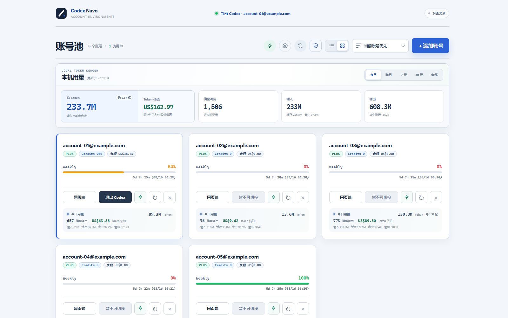
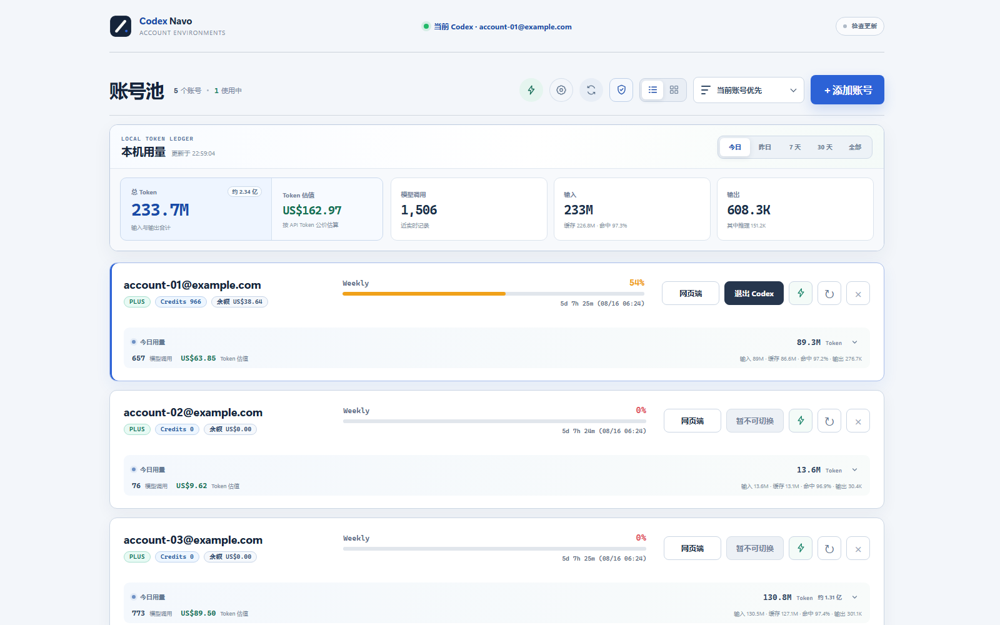
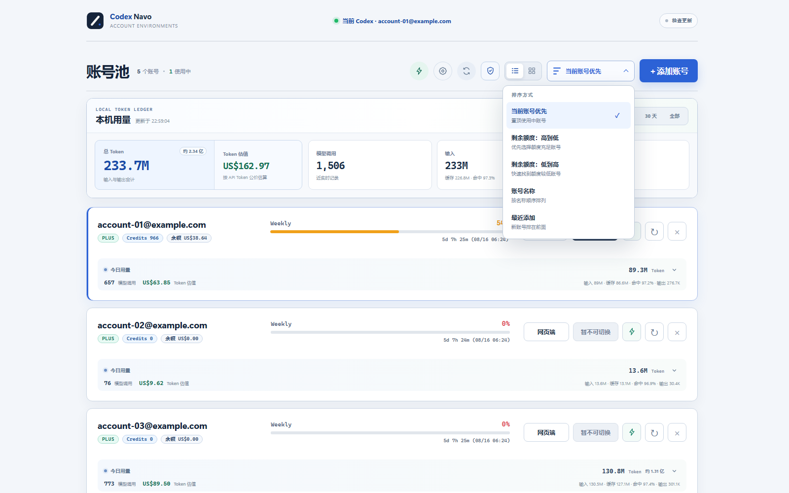
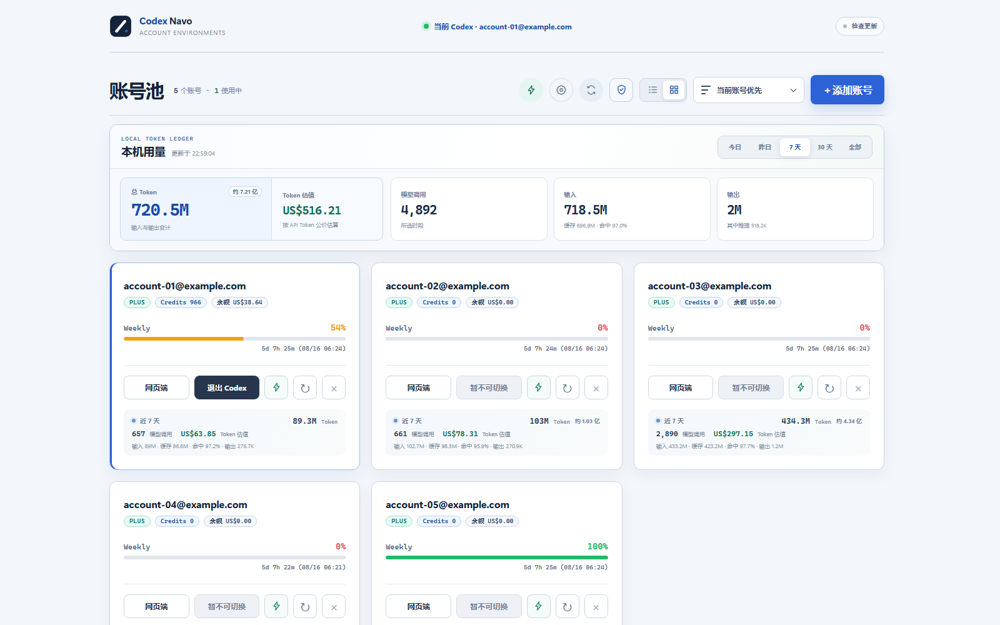
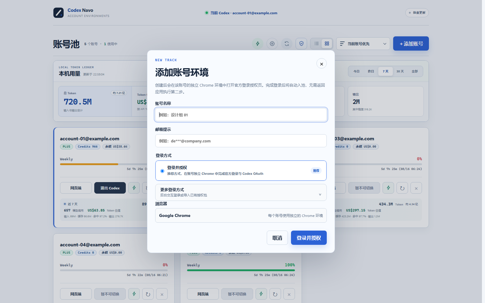
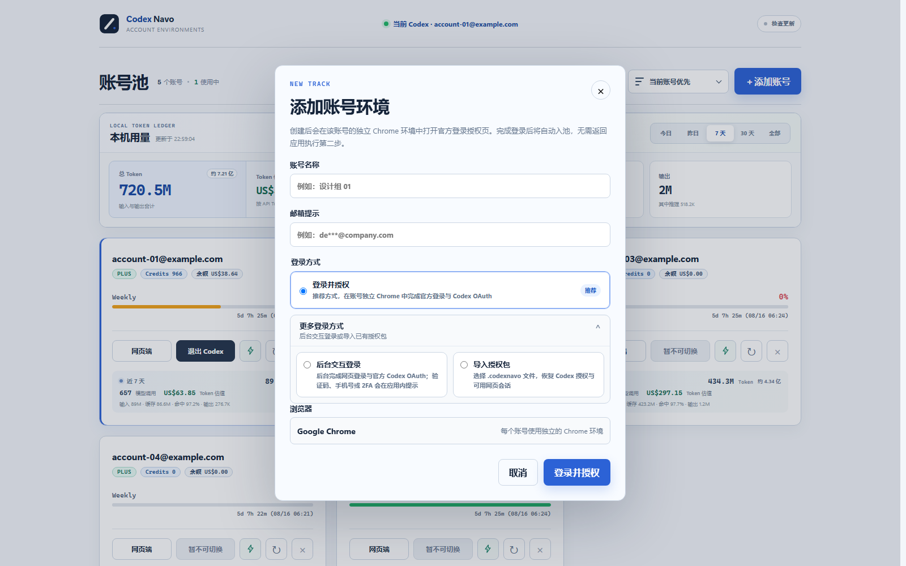
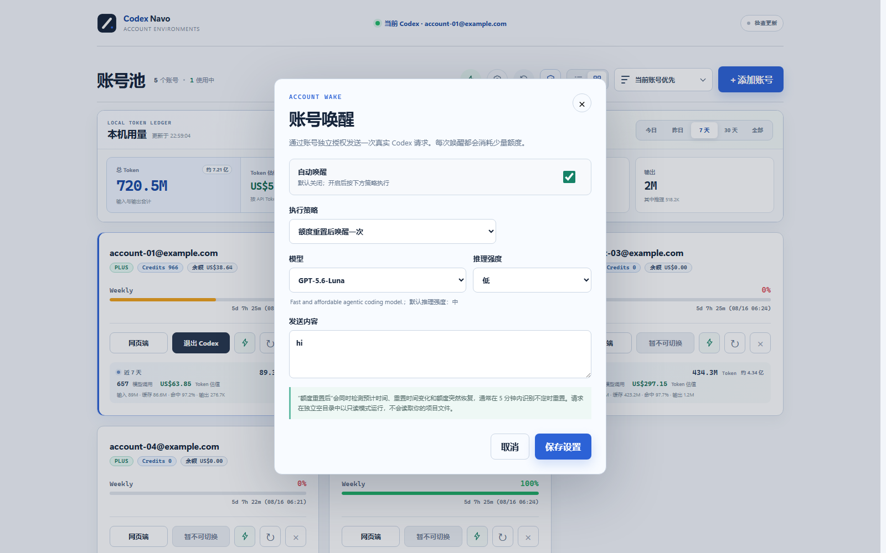
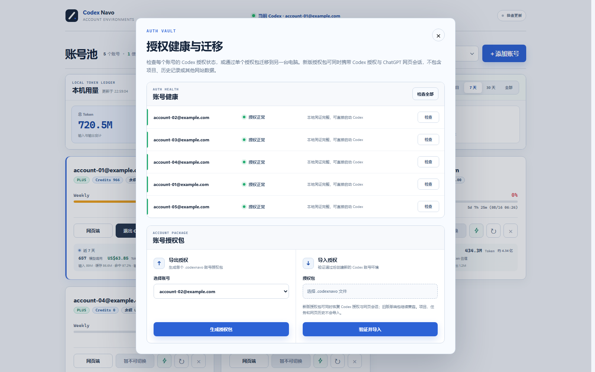

# Codex Navo — Codex 多账号管理与切换工具

**Windows 上的 ChatGPT / Codex 多账号管理器（multi-account manager & account switcher）。**

Codex Navo 是一款开源的 Codex 账号管理、账号切换与额度查看桌面工具，支持独立 Chrome 登录环境、Codex Desktop / CLI OAuth、Token 用量统计、账号唤醒、授权检查与迁移。

如果你有多个 Codex 账号，最麻烦的通常不是使用，而是：

- 每次都要退出、重新登录；
- 不知道哪个账号还有额度；
- 网页端登录的是一个账号，Codex 桌面端却是另一个；
- 切换账号后，担心原来的项目和任务不见了。

Codex Navo 就是用来解决这些问题的。

它会给每个账号创建一个**独立的 Chrome 登录环境**。第一次完成登录和 Codex 授权后，以后打开软件就能看到所有账号的状态，可以直接打开网页端或切换 Codex 桌面端。



## 简单来说，它可以做什么？

### 1. 把多个账号放进一个账号池

不用再记哪个浏览器登录了哪个账号。每个账号都有自己的 Chrome 环境、登录状态和 Codex 授权，互不干扰。

### 2. 看哪个账号还有额度

直接查看每个账号的：

- 套餐；
- Weekly 周额度；
- Credits；
- 美元余额；
- 下次额度重置时间。

正在使用的账号每分钟刷新一次，其他账号每五分钟刷新一次，也可以手动一键刷新全部账号。

### 3. 一键打开网页端

点击账号后面的 **网页端**，会打开这个账号自己的独立 Chrome 窗口。不同账号的 Cookie、标签页和浏览记录不会混在一起。

### 4. 一键切换 Codex 桌面端账号

选择账号后点击 **登录 Codex / 切换账号**，Codex Navo 会使用对应账号的授权启动 Codex 桌面端。

切换的是登录账号，不是项目目录。原来的本机项目、任务和工作区仍然保留。

### 5. 查看 Codex 本机用量

可以查看今天、昨天、近 7 天、近 30 天或全部时间的：

- Token 总量；
- 模型调用次数；
- 输入、缓存和输出 Token；
- 缓存命中率；
- 按公开 API 价格计算的 Token 估值。

### 6. 唤醒账号

可以给单个账号或全部账号发送一次真实的 Codex 请求，也可以设置：

- 每天自动唤醒一次；
- 额度重置后自动唤醒一次；
- 使用哪个模型；
- 推理强度；
- 发送什么内容。

### 7. 检查和迁移账号授权

可以检查账号的 Codex 授权是否仍然有效，也可以导出一个 `.codexnavo` 文件，再在另一台电脑上导入。

授权包可以迁移 Codex 授权和导出时仍有效的网页会话，不包含密码、项目、任务、网页历史或其他网站的数据。

## 功能截图

以下截图中的邮箱均已替换成演示地址。

### 卡片模式

适合账号不多时使用，可以同时看到额度、状态、余额和今日用量。


### 列表模式

账号较多时可以切换到列表模式，方便快速比较额度和使用情况。



### 排序与视图切换

可以在卡片和列表模式之间切换，并按当前账号、剩余额度、账号名称或添加时间排序。



### 历史 Token 用量

顶部可以切换今天、昨天、近 7 天、近 30 天和全部时间；总量与每个账号的明细会同步变化。



### 添加账号

填写一个方便识别的名称，然后点击 **登录并授权**。软件会打开这个账号专属的 Chrome 环境。



### 更多登录方式

除了推荐的官方浏览器登录，还可以使用后台交互登录，或者直接导入已有的 `.codexnavo` 授权包。



### 账号唤醒

每个账号可以单独设置唤醒策略、模型、推理强度和发送内容。



### 授权检查与迁移

可以检查单个或全部账号，也可以生成和导入账号授权包。



## 怎么开始？

### 第一步：下载安装

前往 [Releases](https://github.com/1080ssf/codex-navo/releases/latest)，下载：

```text
Codex-Navo-Setup-<版本>-windows-x64.exe
```

安装前需要准备：

- Windows 11 x64；
- Google Chrome；
- Codex 桌面应用；
- Codex CLI。

### 第二步：添加账号

打开 Codex Navo，点击右上角的 **添加账号**，然后选择推荐的 **登录并授权**。

软件会打开一个独立 Chrome 窗口。请在这个窗口里完成 OpenAI 官方登录和 Codex 授权。

### 第三步：开始使用

授权完成后，账号会自动进入账号池。以后可以直接：

- 点击 **网页端** 打开对应 ChatGPT 账号；
- 点击 **登录 Codex / 切换账号** 使用对应账号启动 Codex；
- 查看额度、余额和本机 Token 用量；
- 手动刷新、唤醒或导出账号授权。

## 常见问题

### 每个账号会互相影响吗？

不会。每个账号使用独立 Chrome 用户目录，不会共用登录 Cookie。

### 切换 Codex 账号后，项目会消失吗？

不会。Codex Navo 只切换 Codex 的登录授权，不会替换本机的项目、任务和工作目录。

### 登录一次后能一直使用吗？

只要 OpenAI 没有让会话失效，独立 Chrome 和 Codex 授权都会继续保留。如果会话过期、账号修改安全设置或服务端要求重新验证，重新登录一次即可。

### 能同时打开多个 Codex 桌面端吗？

不能。Codex 桌面端是单实例应用。同一时间只能有一个账号使用 Codex，但多个账号的网页端可以分别打开。

### 关闭 Codex Navo 后为什么还在运行？

点击右上角关闭按钮后，软件会进入 Windows 系统托盘。右键托盘图标并选择 **退出应用** 才会完全退出。

### Token 估值是实际扣款吗？

不是。它只是按照公开 API Token 价格计算的参考值，不代表 Plus / Pro 套餐真实扣款。

### `.codexnavo` 文件包含什么？

它可能包含仍然有效的 Codex 登录授权和网页会话，因此应当像账号凭证一样保管。它不包含密码、项目、任务、网页历史或其他网站 Cookie。

## 关于设备代码授权

推荐的浏览器 OAuth 登录通常不需要开启设备代码授权。

如果浏览器回调失败，并且你选择使用设备代码备用流程，请先在 ChatGPT 中打开：

**设置 → 账户安全与登录 → 为 Codex 启用设备代码授权**


## 数据保存在哪里？

账号配置、独立 Chrome 环境和 Codex 授权默认保存在：

```text
%LOCALAPPDATA%\Codex Switchboard
```

这个目录名称来自早期版本。为了保证升级后仍能读取原有账号，目前继续保留这个名称。

这些运行数据不会提交到 GitHub。请不要把该目录、未打码截图或 `.codexnavo` 文件公开上传。

## 从源码运行

<details>
<summary>点击展开开发者说明</summary>

需要 Node.js 20 或更高版本：

```powershell
git clone https://github.com/1080ssf/codex-navo.git
cd codex-navo
npm install
Copy-Item config/settings.example.json config/settings.json
npm run dev
```

测试和构建：

```powershell
npm test
npm run test:smoke
npm audit --audit-level=high
npm run build:desktop
```

安装包会生成到 `release/auto-update/`。

</details>

## 使用说明

- Codex Navo 目前主要在 Windows 11 x64 上测试。
- 安装包暂未使用商业代码签名，Windows SmartScreen 可能显示未知发布者提示。
- 软件通过 OpenAI 官方登录和授权流程工作；登录状态最终以 OpenAI 服务端校验为准。
- 切换或退出 Codex 账号前，请先让正在运行的任务正常结束。

Codex Navo 不是 OpenAI 官方产品，与 OpenAI 没有隶属或背书关系。

## 反馈

- 普通问题可以提交 GitHub Issue。
- Issue 中不要附带真实账号、认证文件、完整日志或未打码截图。
- 安全问题请使用 GitHub Private Vulnerability Reporting，详见 [SECURITY.md](SECURITY.md)。

## License

[MIT License](LICENSE)
